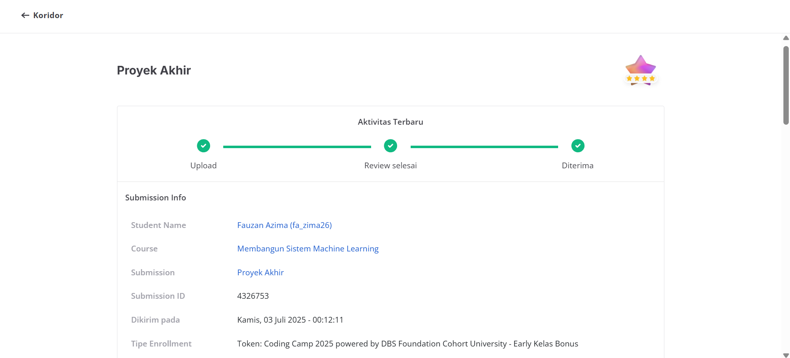
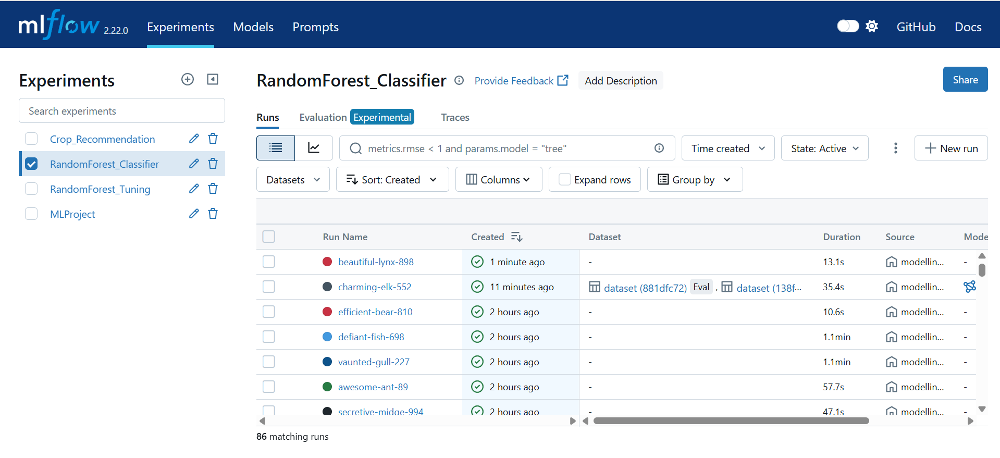
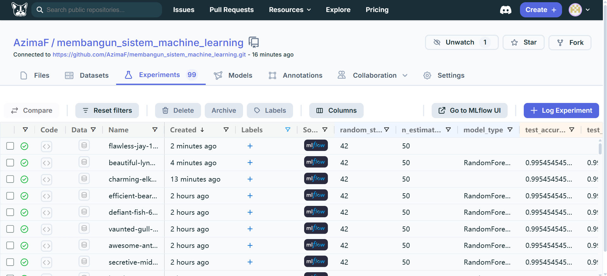
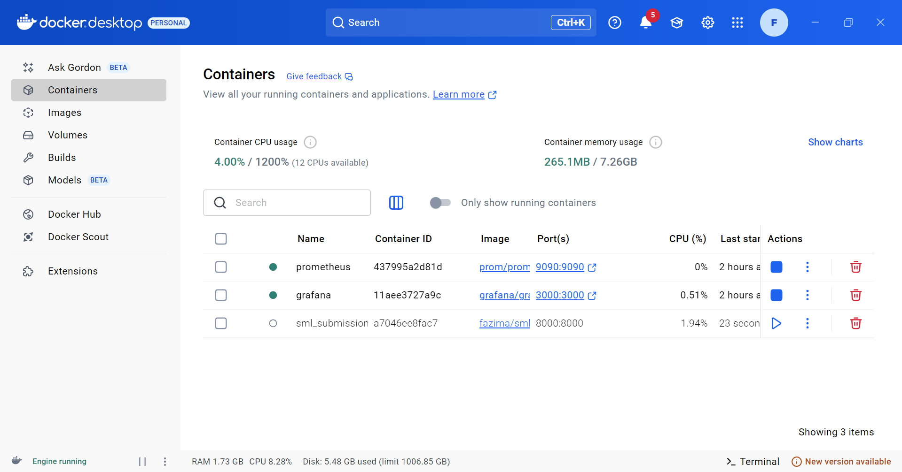

# Membangun Sistem Machine Learning

Repository ini merupakan hasil pengerjaan project dari modul **Membangun Sistem Machine Learning** di [Dicoding](https://www.dicoding.com/). Repository ini disusun sebagai portofolio untuk mendemonstrasikan implementasi *end-to-end* pengembangan sistem Machine Learning.

**Username Dicoding:** [fa_zima26](https://www.dicoding.com/users/fa_zima26/)

---

## 🚀 Gambaran Umum Proyek (Project Overview)
Proyek ini mengimplementasikan siklus lengkap dari Machine Learning, mulai dari prapemrosesan data, eksperimen model, pembangunan model (modelling), Continuous Integration (CI), hingga deployment (serving) dan monitoring system menggunakan stack teknologi modern.

Studi Kasus: **Sistem Rekomendasi Tanaman (Crop Recommendation)** menggunakan model Random Forest.

## 📁 Struktur Repository
Repository ini dibagi menjadi 4 bagian utama sesuai dengan alur pembelajaran:

### 1. Eksperimen Model (`Eksperimen_Fauzan`)
Meliputi tahap awal pipeline data, seperti pemrosesan dataset (`crop_recom_raw` dan `preprocessing`) yang dikelola agar siap digunakan untuk tahap eksperimentasi.

### 2. Membangun Model (`membangun_model`)
Berisi script untuk melatih model Machine Learning dan melakukan *hyperparameter tuning*. Pada tahap ini, eksperimen dilacak menggunakan **MLflow** yang terintegrasi dengan **DagsHub** untuk menyimpan setiap metrik, parameter, dan artefak model terbaik (`random_forest_model.pkl`).
- **Script Modelling:** `modelling.py` & `modelling_tuning.py`
- **DagsHub Tracking:** [Eksperimen DagsHub](https://dagshub.com/AzimaF/membangun_sistem_machine_learning/experiments)

 

### 3. Workflow CI (`Workflow-CI-main`)
Menerapkan otomatisasi pengujian dan continuous integration menggunakan **GitHub Actions**. Setiap kali ada perubahan kode atau push, workflow akan otomatis berjalan untuk memastikan kode dan proses training model berjalan dengan baik tanpa error.
- **Workflow Repository External:** [AzimaF/Workflow-CI](https://github.com/AzimaF/Workflow-CI/tree/main)

### 4. Monitoring dan Logging (`Monitoring_dan_Logging`)
Tahap akhir di mana model disajikan (serving) menjadi sebuah API menggunakan **Flask**. Performa API (seperti *latency*) dipantau secara *real-time*.
- **Serving:** `inference.py` menggunakan Flask API.
- **Monitoring:** Menggunakan **Prometheus** untuk mengekspos dan mengumpulkan metrik performa (`prometheus_exporter.py`), yang kemudian divisualisasikan menggunakan **Grafana** dashboard.
- **Containerization:** Dibungkus menggunakan **Docker** (`Dockerfile` dan `docker-compose.yml`) agar mudah di-deploy di berbagai environment.

 

---

## 🛠️ Teknologi yang Digunakan
- **Machine Learning:** Scikit-Learn, Pandas
- **Experiment Tracking:** MLflow, DagsHub
- **Model Serving:** Flask
- **Monitoring:** Prometheus, Grafana
- **CI/CD & DevOps:** GitHub Actions, Docker, Docker Compose

---
*Portofolio ini dibuat oleh Fauzan (fa_zima26)*